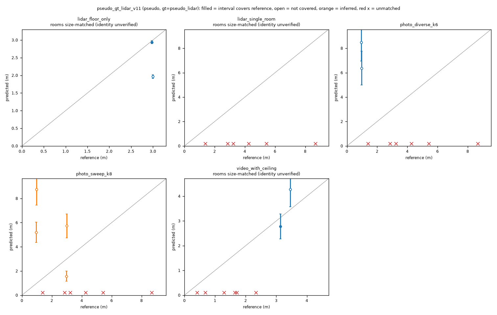
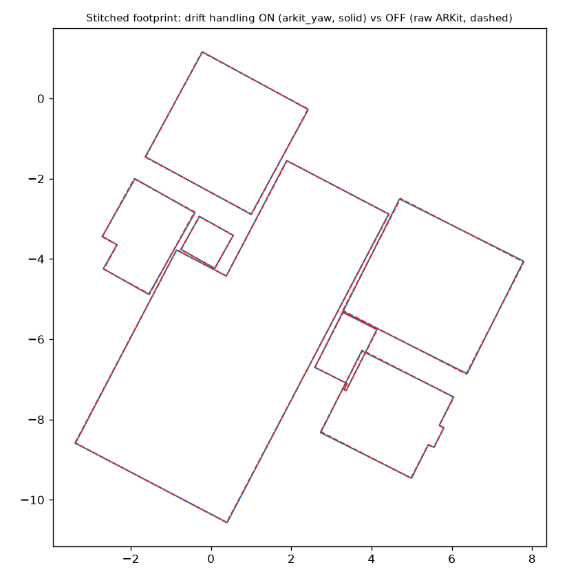

# Benchmark report

Generated by `reports/build_reports.py` from `reports/data/*.json` (regenerate with `--regenerate`). No number below was typed by hand.

> **There is no laser/tape benchmark yet** (no iPhone available): no result here is benchmark accuracy. Sections are labelled PSEUDO-GT (scored against our own LiDAR reconstruction of the supplied capture; LiDAR and the ARKit trajectory disagree by ~3 %, e08), GT-FREE (internal consistency), or SYNTHETIC (rendered exact geometry: tests code, not sensors).

## 1. Per-tier results on the supplied data [PSEUDO-GT]

Site `pseudo_gt_lidar_v11` (purpose `pseudo`, gt_kind `pseudo_lidar`): reference = LiDAR v1.1 plan of `single_scan_with_ceiling`; code da88a97. The reference capture is never scored against itself. Photo folders are simulated from walkthrough frames (e23).

| capture | tier | rooms matched | match | walls scored | walls within tier gate | median \|wall err\| | median \|area err\| | interval coverage | flags |
|---|---|---|---|---|---|---|---|---|---|
| lidar_floor_only | lidar | 1/6 | perimeter | 4 | — | 17.9 % | 35.3 % | 2/5 | 2 |
| lidar_single_room | lidar | 1/6 | perimeter | 0 | — | — % | 22.9 % | 0/1 | 3 |
| photo_diverse_k6 | photo | 2/6 | label | 4 | 0 % (±8 %) | 680.0 % | 2921.9 % | 2/7 | 9 |
| photo_sweep_k8 | photo | 3/6 | label | 8 | 0 % (±8 %) | 271.5 % | 44.3 % | 2/12 | 11 |
| video_with_ceiling | video | 2/6 | perimeter | 4 | 0 % (±3 %) | 17.6 % | 12.9 % | 4/6 | 9 |

Size-matched rooms (`perimeter`) have unverified identity. Video rooms by true identity (`video_identity.py`, ARKit room labels used for evaluation only):

| video room | time span (s) | area (m²) | true room | true area (m²) | area error |
|---|---|---|---|---|---|
| v0 | 12–24 | 0.07 | r1 | 32.48 | -99.8 % |
| v1 | 48–60 | 4.32 | r8 | 10.84 | -60.1 % |
| v2 | 72–84 | 11.92 | r1 | 32.48 | -63.3 % |

## 2. LiDAR repeatability [GT-FREE]

Production code, e18 protocol: topology from all data, wall lengths re-measured from two disjoint 2 s-chunk halves of the same capture (each ~50 % of the data). **Not the repeatability gate**, which needs two separate captures (blocked).

| config | rooms with outline | walls | wall Δ median (mm) | wall Δ p90 (mm) | walls within max(1 cm, 0.5 %) | ceilings Δ ≤ 1 cm |
|---|---|---|---|---|---|---|
| v1_0 | [1, 3, 4, 7, 8] | 26 | 10.1 | 41.8 | 65 % | 50 % |
| ladder | [1, 2, 3, 4, 6, 7, 8] | 38 | 10.1 | 41.0 | 60 % | 60 % |

## 3. Drift ON/OFF [GT-FREE]

Drift handling = room-local measurement (each room from its own registered visits) + common-Manhattan-yaw placement (`arkit_yaw`); room translations are as ARKit placed them. Production pipeline, ON vs OFF (raw ARKit placement):

| placement | rooms | sum of room areas (m²) | union footprint (m²) | total room overlap (m²) | max pair overlap (m²) |
|---|---|---|---|---|---|
| on_arkit_yaw | 7 | 64.245 | 64.147 | 0.098 | 0.098 |
| off_raw_arkit | 7 | 64.245 | 64.151 | 0.093 | 0.093 |

Yaw applied per room by the ON placement (deg; rooms rotate about their own centroids, which do not move): {'r1': 0.14, 'r2': -0.86, 'r3': -0.36, 'r4': -0.86, 'r6': 0.64, 'r7': 0.64, 'r8': 0.64}

**Reading:** on this capture the production placement changes the stitched footprint negligibly — room translations are ARKit's. The drift handling that measurably matters acts on room *dimensions* (per-room registration of visits that disagree by 30–160 mm, e22), not on room *placement*. For the drift gate ("poses used as-is is an automatic fail") the placement is at risk; translation stitches that were tried made placement worse (table below).

Placement disagreement between two disjoint halves of the capture after a rigid fit (e19, GT-free; corners, mm):

| stitch variant | corner median | corner p90 | corner max |
|---|---|---|---|
| A raw ARKit | 54.8 | 96.8 | 115.8 |
| B1 + common yaw (production) | 66.0 | 84.4 | 93.8 |
| B2 + doorway constraints (none measurable) | 66.0 | 84.4 | 93.8 |
| B3 + shared walls, one thickness | 69.2 | 104.6 | 120.0 |
| B4 + shared walls, per-wall thickness | 90.5 | 111.7 | 127.0 |

## 4. Synthetic validation [SYNTHETIC — not benchmark evidence]

Exact rendered two-room capture (`src/roomscan/synthetic.py`), LiDAR tier, scored by the same evaluator (fix-loop site):

| run | rooms | wall errors (mm) | ceiling errors (mm) | doorway error (mm) |
|---|---|---|---|---|
| before_fix | 2/2 | -1.1, -498.9, -1.1, -498.9, -4.8, -1003.8, -4.8, -1003.8 | -1.2, -1.7 | +10 |
| after_fix | 2/2 | -2.2, -1.9, -2.2, -1.9, -2.2, -2.1, -2.2, -2.1 | -1.2, -1.6 | +10 |

## 5. Timing (Apple M4, 16 GB, MPS) [MEASURED]

| run | seconds |
|---|---|
| lidar_floor_only | 15.3 |
| lidar_single_room | 6.6 |
| photo_diverse_k6 | 136.2 |
| photo_sweep_k8 | 137.3 |
| video_with_ceiling | 479.5 |
| lidar_with_ceiling | 32.7 |
| lidar_with_ceiling_arkit | 33.5 |

## 6. Interval coverage

Coverage = fraction of reference values inside the stated 90 % intervals (uncalibrated) in section 1. Intervals widen with measured geometric instability (`src/roomscan/quality.py`), but rooms that are consistently wrong are reported by flags, not covered. Calibration requires laser GT (blocked).

## 7. Missing real benchmark evidence (BLOCKED: no iPhone)

- Laser/tape GT, the multi-room benchmark at all three tiers, the damage room, repeat captures: none exist.
- Opening-width gate, ceiling gate, repeatability gate, photo stitch gate, photo/video wall gates on real captures: not evaluated.
- Head-to-head vs a consumer app (magicplan/Polycam): no export exists.
- Real-device file formats (Stray current version, HEIC, MOV) are tested only with synthetic files.
- Walk-in readiness on an unseen space: untested.
